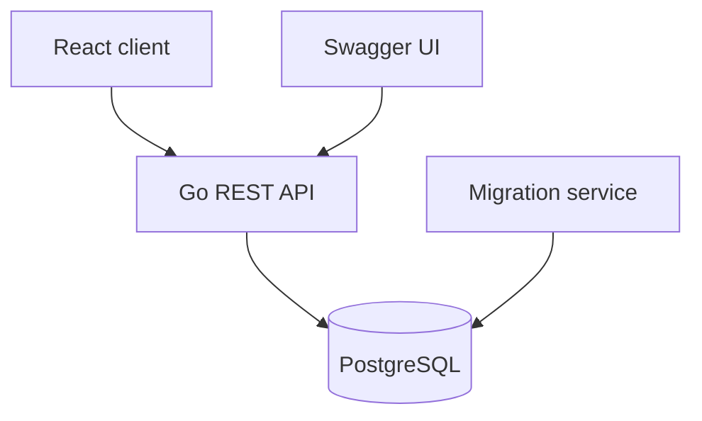

# TradeOn

TradeOn is a multi-vendor marketplace for managing stores, products, categories, customers and orders.

The project combines a Go REST API, PostgreSQL database and a React frontend in a Docker Compose environment.

## Features

- JWT authentication with access and refresh tokens
- User management
- Store creation and management
- Product management
- Product categories and attributes
- Customer and order management
- PostgreSQL migrations
- Request validation
- Swagger API documentation
- Responsive administrative interface
- Docker Compose development environment

## Tech Stack

### Backend

- Go
- Gin
- PostgreSQL
- pgx
- JWT
- Swagger / OpenAPI
- Go Playground Validator

### Frontend

- React
- TypeScript
- Vite
- Material UI
- React Query
- Axios
- React Hook Form
- Zod
- Zustand

### Infrastructure

- Docker
- Docker Compose
- PostgreSQL 17
- Database migrations

## Architecture



The project contains four Docker Compose services:

| Service | Responsibility |
|---|---|
| `frontend` | React user interface |
| `backend` | Go REST API |
| `database` | PostgreSQL database |
| `migrate` | Database schema migrations |

## Project Structure

```text
.
├── backend/
│   ├── cmd/api/       # Backend entry point
│   ├── internal/      # Business logic and application layers
│   ├── migrations/    # PostgreSQL migrations
│   └── docs/          # Generated Swagger documentation
├── frontend/          # React and TypeScript application
├── compose.yaml       # Docker Compose configuration
└── .env.example       # Example environment configuration
```

## Getting Started

### Prerequisites

- Git
- Docker
- Docker Compose

### Installation

Clone the repository:

```bash
git clone https://github.com/shaimurat/tradeOn.git
cd tradeOn
```

Create the environment file:

```bash
cp .env.example .env
```

Start the application:

```bash
docker compose up --build
```

After the containers are started:

- Frontend: `http://localhost:3000`
- Backend API: `http://localhost:8080/api`
- Swagger UI: `http://localhost:8080/api/swagger/index.html`

Stop the application:

```bash
docker compose down
```

Remove containers and local database volumes:

```bash
docker compose down -v
```

> Running the command with `-v` permanently deletes the local PostgreSQL data.

## API

The API uses the following base path:

```text
/api
```

Main API groups include:

- authentication;
- users;
- stores;
- products;
- categories;
- product attributes;
- customers;
- orders.

### Example request

```bash
curl http://localhost:8080/api/products
```

Protected endpoints require a JWT access token:

```http
Authorization: Bearer <access-token>
```

## Swagger

Interactive Swagger documentation is available after starting the backend:

```text
http://localhost:8080/api/swagger/index.html
```

Swagger can be used to:

- inspect available endpoints;
- view request and response schemas;
- test API requests;
- authorize requests with a JWT token.

## Development

### Backend

```bash
cd backend
go mod download
go run ./cmd/api
```

### Frontend

```bash
cd frontend
npm install
npm run dev
```

## Tests and Checks

Run backend tests:

```bash
cd backend
go test ./...
```

Run frontend linting:

```bash
cd frontend
npm run lint
```

Verify the production frontend build:

```bash
cd frontend
npm run build
```


## My Role

**Danial Shaimurat — Full-stack Developer**

Responsibilities:

- REST API development with Go and Gin
- PostgreSQL schema and migration development
- JWT authentication
- Store, product and category management
- Swagger documentation
- React frontend integration
- Docker Compose configuration
